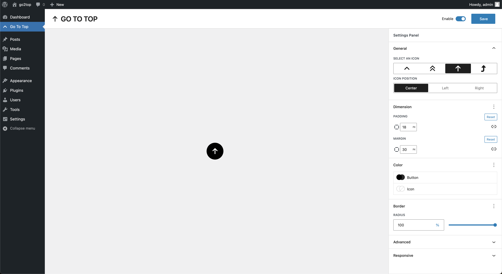

# Go To Top 
Experimental WordPress plugin to add go to top button on frontend with setting panel to personalize.



# Usage

01. Clone repo to your `wp-content/plugins`

``` sh
git clone git@github.com:lubusIN/go-to-top-for-wordpress.git 
```

02. Go to plugin folder
``` sh
cd go-to-top-for-wordpres
```

03. Install npm dependency
``` sh
npm install
``` 

04. Build plugin
``` sh
npm run build
```

05. Activate plugin from plugin list

06. Config and use 🚀

## Craftsmen
- [Ajit Bohra](https://twitter.com/ajitbohra)
- [Punit Verma](https://github.com/punitverma123)
- [Nikhil Sharma](https://github.com/NikhilSharma666)

## Meet Your Artisans
[LUBUS](http://lubus.in) is a web design agency based in Mumbai, India.

<a href="https://lubus.in/">

</a>

## License

`Go To Top For WordPress` is an open-source software licensed under the [MIT](LICENSE)
